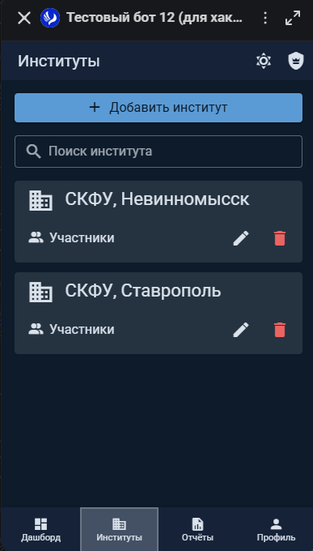
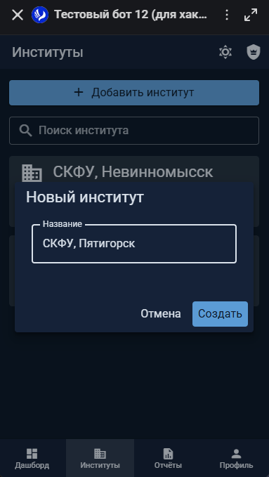
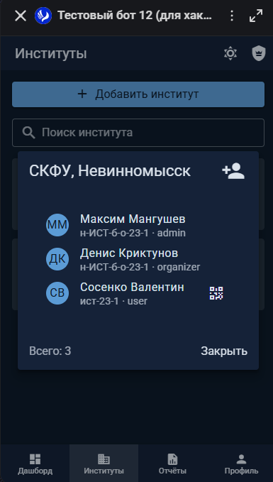
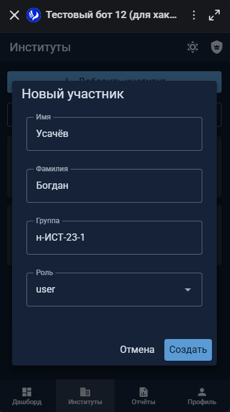
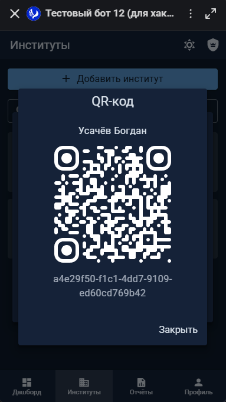
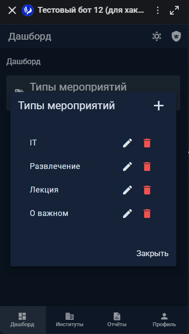
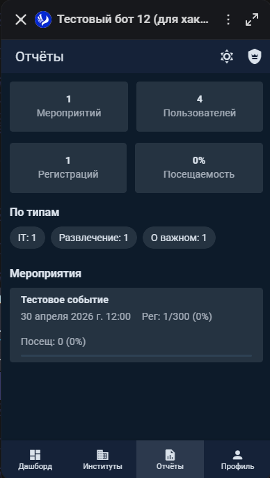

# Интерфейс администратора

## Обзор

Администратор управляет институтами, пользователями и типами мероприятий. Доступ к панели администратора появляется в нижней навигации для пользователей с ролью `admin`.

---

## Управление институтами

Раздел «Институты» — основной инструмент администратора. Здесь создаются институты и добавляются пользователи.

### Создание института

1. Откройте раздел «Институты» в панели администратора
2. Нажмите кнопку «Добавить институт»
3. Введите название института
4. Нажмите «Создать»

### Редактирование и удаление

- Нажмите на иконку карандаша на карточке института для редактирования названия
- Нажмите на иконку корзины для удаления

::: warning Внимание
При удалении института каскадно удаляются все пользователи, привязанные к нему.
:::

---

## Управление пользователями

### Просмотр участников института

1. Нажмите на карточку института
2. Откроется список участников с пагинацией (подгрузка при скролле)
3. Для каждого пользователя отображается: имя, фамилия, группа, роль

### Создание пользователя

1. В списке участников института нажмите иконку «+» в заголовке
2. Заполните форму:
   - Имя
   - Фамилия
   - Группа
   - Роль (студент / организатор / администратор)
3. Нажмите «Создать»

После создания автоматически откроется QR-код пользователя.

### QR-код для регистрации

После создания пользователя (или по нажатию на иконку QR рядом с незарегистрированным пользователем) отображается QR-код.

Этот QR-код содержит уникальный `guid` пользователя. Администратор передаёт его студенту (показывает на экране или распечатывает). Студент сканирует код в приложении MAX для завершения регистрации.

::: tip Подсказка
Иконка QR отображается только у незарегистрированных пользователей (тех, кто ещё не отсканировал код). После привязки аккаунта MAX иконка исчезает.
:::

### Редактирование пользователя

1. Нажмите на пользователя в списке участников
2. Измените нужные поля (имя, фамилия, группа, роль)
3. Нажмите «Сохранить»

---

## Управление типами мероприятий

Типы мероприятий — это категории (например: «Лекция», «Конференция», «Спорт»), которые используются для фильтрации событий.

1. Откройте «Дашборд» в панели администратора
2. Нажмите на карточку «Типы мероприятий»
3. В диалоге можно:
   - Создать новый тип (иконка «+»)
   - Редактировать существующий (иконка карандаша)
   - Удалить (иконка корзины)

---

## Отчёты

Раздел «Отчёты» в панели администратора содержит общую статистику по мероприятиям, посещаемости и пользователям.

