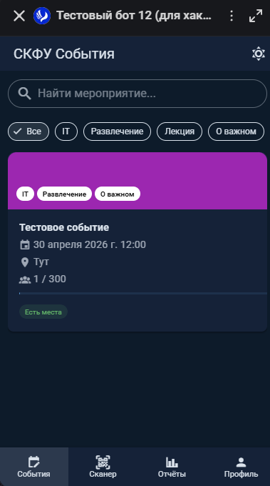
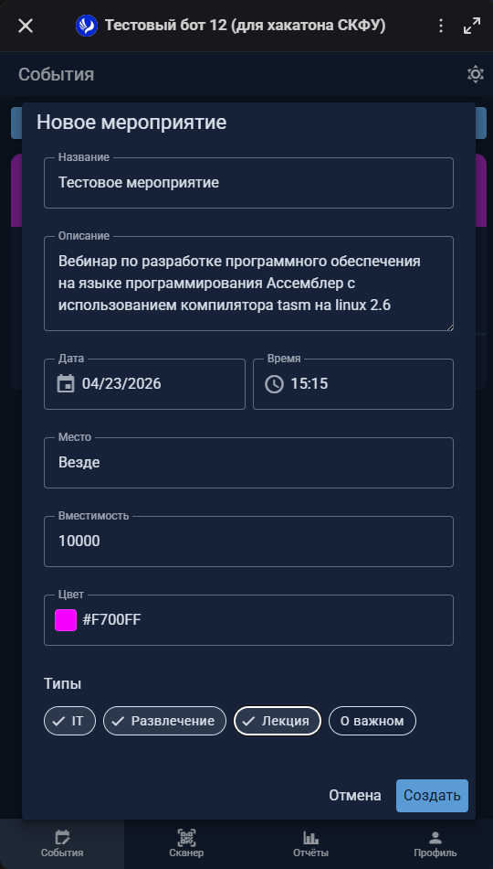
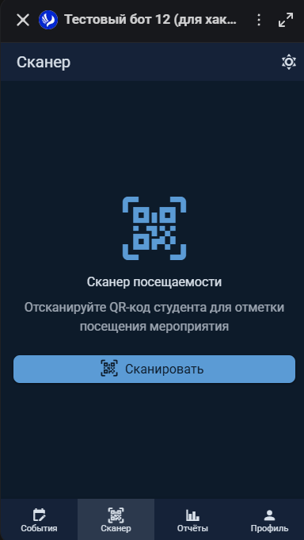
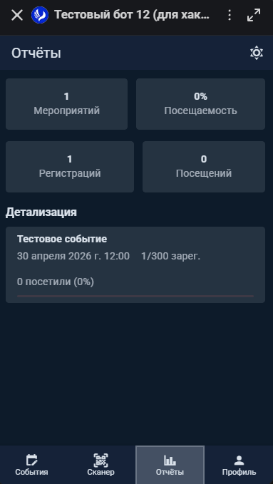

# Интерфейс организатора

## Обзор

Организатор создаёт мероприятия, управляет ими и отмечает посещаемость студентов через QR-сканер. Панель организатора доступна в нижней навигации для пользователей с ролью `organizer` или `admin`.

Панель содержит три раздела: Мероприятия, Сканер, Отчёты.

---

## Мероприятия

### Список мероприятий

На странице «Мероприятия» отображаются все созданные события с цветным баннером, типами, датой, местом и заполненностью.

Прогресс-бар показывает заполненность: зелёный — есть места, красный — мест нет.

### Создание мероприятия

1. Нажмите «Создать мероприятие»
2. Заполните форму:

| Поле | Описание |
|---|---|
| Название | Заголовок мероприятия (до 255 символов) |
| Описание | Подробное описание (до 2000 символов) |
| Дата | Выбор даты через календарь |
| Время | Выбор времени через пикер |
| Место | Место проведения |
| Вместимость | Максимальное количество участников |
| Цвет | Цвет баннера (выбор через палитру) |
| Типы | Категории мероприятия (множественный выбор из существующих типов) |

3. Нажмите «Создать»

::: tip Подсказка
Типы мероприятий создаются администратором в разделе «Дашборд → Типы мероприятий». Если нужного типа нет — обратитесь к администратору.
:::

### Редактирование мероприятия

1. Нажмите иконку карандаша на карточке мероприятия
2. Измените нужные поля
3. Нажмите «Сохранить»

После сохранения всем зарегистрированным участникам автоматически отправляется уведомление в бот MAX с обновлёнными данными мероприятия.

---

## QR-сканер посещаемости

Основной инструмент организатора на мероприятии. Позволяет отмечать присутствие студентов.

### Как это работает

1. Откройте раздел «Сканер» в панели организатора
2. Нажмите «Сканировать»
3. Приложение откроет камеру через MAX WebApp API (`openCodeReader`)
4. Наведите камеру на QR-код студента
5. Система автоматически отметит посещение

### Что происходит при сканировании

1. Студент показывает QR-код из своей страницы мероприятия (содержит `registrationGuid`)
2. Организатор сканирует код
3. Бэкенд находит регистрацию по `registrationGuid` и ставит `attended = true`
4. На экране организатора появляется подтверждение «Посещение отмечено»

### Счётчик

Внизу экрана отображается количество отмеченных за текущую сессию.

### Ошибки

- «QR-сканер недоступен вне приложения» — сканер работает только внутри мессенджера MAX
- «Ошибка: регистрация не найдена» — QR-код невалидный или студент не зарегистрирован на мероприятие

---

## Отчёты

Раздел «Отчёты» содержит статистику по мероприятиям организатора:

- Общее количество мероприятий
- Общее количество регистраций и посещений
- Процент посещаемости
- Детализация по каждому мероприятию (зарегистрировано / посетило / заполненность)
- Распределение по типам мероприятий

