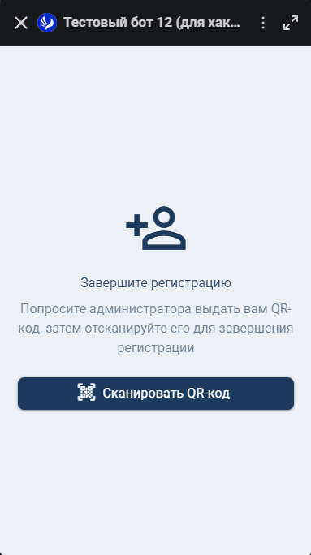
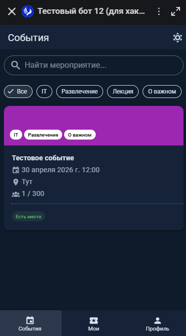
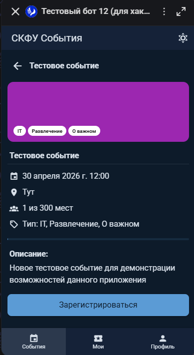
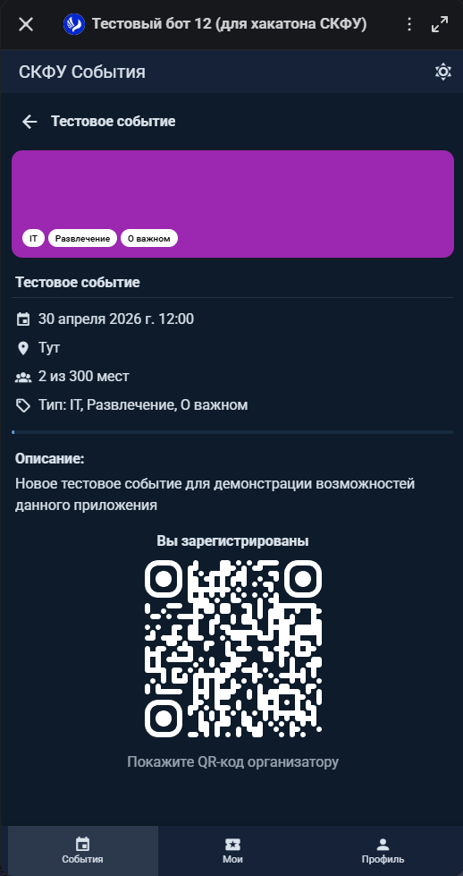
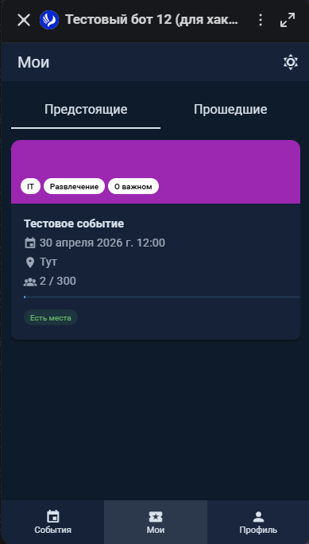
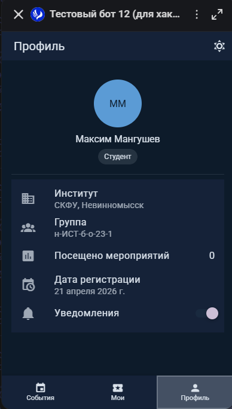

# Интерфейс студента

## Обзор

Студент — основной пользователь приложения. Может просматривать мероприятия, регистрироваться на них, отслеживать свою посещаемость и показывать QR-код организатору для отметки присутствия.

---

## Регистрация в системе

### Шаг 1: Получение QR-кода

Администратор создаёт учётную запись студента в панели управления и выдаёт QR-код (показывает на экране или распечатывает).

### Шаг 2: Сканирование QR-кода

1. Откройте бота в мессенджере MAX
2. Приложение покажет экран «Завершите регистрацию»
3. Нажмите «Сканировать QR-код»
4. Наведите камеру на QR-код от администратора
5. После успешного сканирования приложение автоматически авторизует вас

::: warning Важно
QR-код одноразовый — после привязки аккаунта MAX повторное сканирование невозможно. Если возникла ошибка, обратитесь к администратору.
:::

### Возможные ошибки

- «Не удалось завершить регистрацию. Проверьте QR-код.» — невалидный или уже использованный код
- «QR-сканер недоступен вне приложения» — приложение нужно открывать через мессенджер MAX

---

## Главная — список мероприятий

После авторизации открывается главная страница со списком всех мероприятий.

### Поиск

Поле поиска вверху страницы фильтрует мероприятия по названию, описанию и месту проведения.

### Фильтрация по типам

Под поиском расположены чипы с типами мероприятий (Все, Конференция, Спорт и т.д.). Нажмите на тип для фильтрации.

### Карточка мероприятия

Каждая карточка содержит:
- Цветной баннер с типами мероприятия
- Название
- Дата и время
- Место проведения
- Количество зарегистрированных / вместимость
- Прогресс-бар заполненности
- Статус: «Есть места» (зелёный) или «Мест нет» (красный)

Нажмите на карточку для перехода на страницу мероприятия.

---

## Страница мероприятия

Детальная информация о мероприятии.

### Информация

- Цветной баннер с типами
- Название и описание
- Дата, время, место
- Количество зарегистрированных из общей вместимости
- Прогресс-бар заполненности

### Регистрация на мероприятие

Если вы ещё не зарегистрированы и есть свободные места:

1. Нажмите кнопку «Зарегистрироваться» внизу страницы
2. После регистрации кнопка заменяется на QR-код

Если мест нет — кнопка неактивна с текстом «Мест нет».

### QR-код для организатора

После регистрации на странице мероприятия отображается QR-код с подписью «Покажите QR-код организатору».

Этот QR-код содержит `registrationGuid` — уникальный идентификатор вашей регистрации. Организатор сканирует его для отметки посещения.

### Завершённые мероприятия

Если мероприятие уже прошло, вместо кнопки регистрации или QR-кода отображается сообщение «Мероприятие завершено».

---

## Мои мероприятия

Раздел «Мои» в нижней навигации показывает мероприятия, на которые вы зарегистрированы.

### Вкладки

- **Предстоящие** — будущие мероприятия
- **Прошедшие** — завершённые мероприятия (отображаются с пониженной прозрачностью)

Нажмите на карточку для перехода на страницу мероприятия.

---

## Профиль

Раздел «Профиль» в нижней навигации.

### Информация

- Аватар (из мессенджера MAX)
- Имя и фамилия
- Роль (Студент / Организатор / Администратор)
- Институт
- Учебная группа
- Количество посещённых мероприятий
- Дата регистрации

### Настройки

- **Уведомления** — переключатель вкл/выкл. Управляет получением уведомлений от бота о предстоящих мероприятиях (утреннее уведомление и напоминание за 30 минут)

---

## Уведомления от бота

Если уведомления включены в профиле, бот отправляет сообщения в личный чат:

- **Утром в день мероприятия (7:00)** — напоминание что сегодня состоится мероприятие
- **За 30 минут до начала** — напоминание что мероприятие скоро начнётся
- **При обновлении мероприятия** — актуальные данные если организатор изменил время, место или другие параметры

Также доступна команда `/events` в боте для просмотра списка предстоящих мероприятий.
